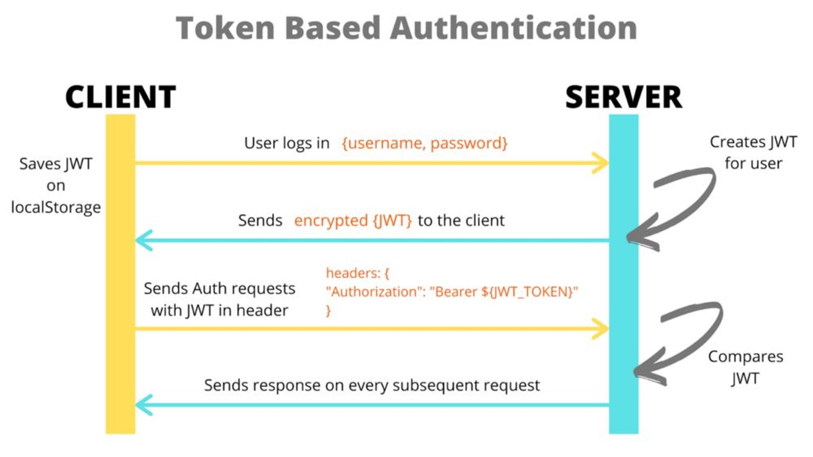

# D3 S2: Authentication with Jso Web Token (JWT)

Watch recoeded video: https://youtu.be/b9jaP3lJmNo

## What is JWT?
A JSON Web Token (JWT) is a compact, URL-safe, and self-contained token format used for securely transmitting information between parties as a JSON object. JWTs are commonly used for authentication and information exchange in web applications and APIs. They consist of three parts separated by dots (`.`): the header, payload, and signature. Here's a breakdown of each part:

1. **Header**: Contains metadata about the type of token and the cryptographic algorithm used to generate the signature. It typically looks like this:
   ```json
   {
     "alg": "HS256",
     "typ": "JWT"
   }
   ```
   In this example, `alg` specifies the algorithm (e.g., HMAC SHA-256) used to create the signature, and `typ` specifies the type of token (JWT).

2. **Payload**: Contains the claims, which are statements about an entity (typically the user) and additional data. Claims are categorized into three types:
    - **Reserved Claims**: These are predefined claims that have specific meanings and should be used when applicable. Examples include `iss` (issuer), `exp` (expiration time), `sub` (subject), and `iat` (issued at).
    - **Public Claims**: These are user-defined claims that convey information relevant to the application. They should be defined in a way that prevents collision with reserved or other public claims.
    - **Private Claims**: These are custom claims agreed upon between parties and are not registered in the official JWT specification.

   A payload might look like this:
   ```json
   {
     "sub": "1234567890",
     "name": "John Doe",
     "admin": true
   }
   ```

3. **Signature**: The signature is created by combining the encoded header, encoded payload, and a secret key using the specified algorithm. It ensures the integrity of the token and allows verification of its authenticity.

JWTs are often used in authentication mechanisms, where a user logs in and receives a JWT as a token of their authenticated session. The server can then validate incoming requests by verifying the JWT's signature and extracting information from the payload. This allows for stateless authentication and secure transmission of data between the client and server.

## Install JWT in Express.js
To use JWT in an Express.js application, you'll need to install the `jsonwebtoken` package, which provides utilities for creating and verifying JWTs. You can install it using npm or yarn:

```bash
npm install jsonwebtoken
```
## Define JWT Secret Key
When creating and verifying JWTs, you'll need a secret key to sign and verify the tokens. It's essential to keep this key secure and not expose it in your codebase. You can define the secret key as an environment variable or in a configuration file. 
Here's an example of defining a secret key in an environment variable in .env and read it using the `dotenv` package:

```javascript
// .env
JWT_SECRET=mysecretkey
```
Then configure `dotenv` to load the environment variables in your basic Express.js application:

```javascript
// app.js
require('dotenv').config();
```
Then you can read the secret key from the environment variable in your application:

```javascript
// app.js
const jwtSecret = process.env.JWT_SECRET;
```
## Authenticate Users with JWT
Here is the diagram of how JWT authentication works:

Here is the explanation of the steps involved in JWT authentication:
1. **User Login**: The user sends their credentials (e.g., username and password) to the server to log in.
2. **Server Verification**: The server verifies the user's credentials against the database. If the credentials are valid, the server generates a JWT containing the user's information (e.g., user ID) and signs it with the secret key.
3. **JWT Creation**: The server creates a JWT using the `jsonwebtoken` package, specifying the payload (user information) and the secret key for signing.
4. **JWT Response**: The server sends the JWT back to the client as part of the login response.
5. **Client Storage**: The client (e.g., browser) stores the JWT securely, typically in local storage or a cookie.
6. **Subsequent Requests**: For subsequent requests, the client includes the JWT in the `Authorization` header of the HTTP request.
7. **Server Verification**: The server receives the JWT in the request header and verifies its authenticity by checking the signature using the secret key.
8. **User Identification**: If the JWT is valid, the server extracts the user information from the payload and uses it to identify the user and process the request.
9. **Protected Routes**: Certain routes or resources on the server may require authentication. The server checks for the presence of a valid JWT in the request header before granting access to these protected routes.
10. **Token Expiration**: JWTs can have an expiration time (specified in the payload), after which they are no longer considered valid. The client must obtain a new JWT by logging in again once the token expires.
11. **Logout**: To log out, the client typically discards the JWT stored in local storage or a cookie. The server does not need to maintain a session or track user logout events, as JWTs are stateless.

## Implement JWT Authentication in Express.js
### Signing Up User
We use `bycrypt` to hash the password before saving it to the database. Here is an example of how to create a new user with hashed password:

```javascript
// controllers/auth.js
const bcrypt = require('bcrypt');
const jwt = require('jsonwebtoken');
const User = require('../models/User');

const signupUser = async(req, res) => {
  try {
    const { username, password } = req.body;
    // Hash the password
    const hashedPassword = await bcrypt.hash(password, 10);
    // Create a new user
    const user = new User({ username, password: hashedPassword });
    const result = await user.save();
    res.status(201).json({ message: 'User created successfully' });
  } catch (error) {
    res.status(500).json({ error: error.message });
  }
};
```
### Logging In User
When a user logs in, we verify their credentials against the database. If the credentials are valid, we generate a JWT and send it back to the client. Here is an example of how to log in a user and generate a JWT:

```javascript
// controllers/auth.js
const loginUser = async(req, res) => {
  try {
    const { username, password } = req.body;
    // Find the user by username
    const user = await User.findOne({ username })
    if (!user) {
      return res.status(401).json({ message: 'Invalid credentials' });
    }
    // Verify the password
    const isValidPassword = await bcrypt.compare(password, user.password);
    if (!isValidPassword) {
      return res.status(401).json({ message: 'Invalid credentials' });
    }
    // Generate a JWT
    const token = jwt.sign({ userId: user._id }, process.env.JWT_SECRET, { expiresIn: '1h' });
    res.status(200).json({ token });
    } catch (error) {
    res.status(500).json({ error: error.message });
    }
}
```
The response from the login route will include the JWT, which the client can store and use for subsequent requests.
It typically looks like this:
```json
{
  "token": "eyJhbGciOiJIUzI1NiIsInR5cCI6IkpXVCJ9.eyJ1c2VySWQiOiI2MzQ1"
}
```
### Protecting Routes with JWT
To protect certain routes that require authentication, we can create middleware that verifies the JWT in the request header. Here is an example of how to create a middleware function to verify the JWT:

```javascript
// middleware/index.js
const jwt = require('jsonwebtoken');
const verifyToken = (req, res, next) => {
  const token = req.headers.authorization;
  if (!token) {
    return res.status(401).json({ message: 'Authentication failed' });
  }
  try {
    const decoded = jwt.verify(token, process.env.JWT_SECRET);
    req.userData = decoded;
    next();
  } catch (error) {
    return res.status(401).json({ message: 'Authentication failed' });
  }
};
```
You can then apply this middleware to routes that require authentication by including it as part of the route handler:

```javascript
// routes/tweets.js
const express = require("express")
const router = express.Router()
const { getTweetById, getAllTweets } = require("../controllers/tweet.js")
const verifyToken = require("../middleware/index.js")

router.get("/", verifyToken, getAllTweets)

router.get("/:id", verifyToken, getTweetById)


module.exports = router
```


