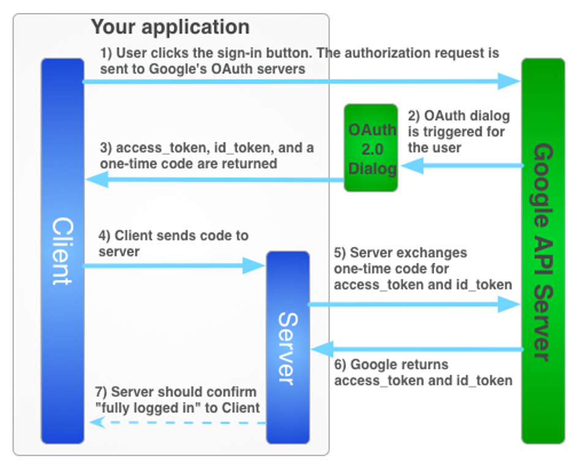

# D4 S3: Google Single Sign-On (SSO) + Integration

Watch recorded class: https://youtu.be/Iy2ceWtbMUg

## What is Google Single Sign-On (SSO)?
[Google Single Sign-On (SSO)](https://developers.google.com/identity/protocols/oauth2) is a mechanism that allows users to authenticate themselves using their Google account credentials.
Google SSO is based on the OAuth 2.0 protocol, which allows third-party applications to obtain limited access to a user's Google account without exposing their credentials.

## SSO Flow

Suppose we have 3 parties involved in the SSO flow: Client, our server, and Google server:
1. User clicks on the "Login with Google" button on the client.
2. The client sends request to Google server to show oauth consent screen.
3. User logs in to Google account and gives consent to the client where `access_token`, `id_token`, and one-time `code` are generated.
4. The client sends the `code` to our server.
5. Our server sends the `code` to Google server to exchange it with `access_token` and `id_token`.
6. Google server sends `access_token` and `id_token` to our server.
7. Our server use `access_token` to fetch user's information from Google server using Google API.
8. Our server perform user registration or login based on the information fetched from Google server.
9. Our server sign its own JWT token and send it back to the client.

## Why use Google SSO?
Google SSO provides a convenient way for users to log in to your application without having to create a new account or remember additional credentials. It also allows you to leverage Google's secure authentication infrastructure, which can help improve the security of your application.

## Implementing Google SSO
### Define environment variables
Create a `.env` file in the root directory of your project and add the following environment variables:
```plaintext
GOOGLE_CLIENT_ID=your_google_client_id
GOOGLE_CLIENT_SECRET=your_google_client_secret
GOOGLE_CALLBACK_URL=http://localhost:3000/auth/google/callback
```

### Create Google OAuth 2.0 Credentials
1. Go to [Google Cloud Console](https://console.cloud.google.com/).
2. Create a new project or select an existing project.
3. Go to `APIs & Services` > `Credentials`.
4. Click on `Create Credentials` > `OAuth client ID`.
5. Select `Web application` as the application type.
6. Add `Authorized redirect URIs` (e.g., `http://localhost:3000/auth/google/callback`).
7. Click on `Create` to generate the client ID and client secret.
8. Note down the `Client ID` and `Client Secret`.

### Define routes for Google SSO
We can 2 routes in our `auth.js` controller file to handle Google SSO:
1. `/auth/google` - Redirects the user to Google's OAuth consent screen.
2. `/auth/google/callback` - Handles the callback from Google server and exchanges the code for access token and id token.

### /auth/google route
We can define the `/auth/google` route in our `auth.js` controller file as follows:
```javascript
// controllers/auth.js
const showGoogleConsentScreen = (req, res) => {
  const googleAuthUrl = `https://accounts.google.com/o/oauth2/v2/auth?client_id=${process.env.GOOGLE_CLIENT_ID}&redirect_uri=${process.env.GOOGLE_CALLBACK_URL}&response_type=code&scope=openid%20profile%20email&access_type=offline`;
  res.redirect(googleAuthUrl);
};
module.exports = { showGoogleConsentScreen };
```
### /auth/google/callback route
We can define the `/auth/google/callback` route in our `auth.js` controller file as follows:
```javascript
// controllers/auth.js
const handleGoogleCallback = async (req, res) => {
  const { code } = req.query;
  // Exchange code for access token and id token
  const { data } = await axios.post('https://oauth2.googleapis.com/token', {
    code,
    client_id: process.env.GOOGLE_CLIENT_ID,
    client_secret: process.env.GOOGLE_CLIENT_SECRET,
    redirect_uri: process.env.GOOGLE_CALLBACK_URL,
    grant_type: 'authorization_code',
  });
  // Fetch user information using access token
    const {access_token, id_token} = data;
    const response = await axios.get(`https://www.googleapis.com/oauth2/v1/userinfo`,
    {
      headers: {
        Authorization: `Bearer ${access_token}`,
      },
    });
    const userprofile = response.data;
    // Perform user registration or login based on userprofile
};
module.exports = { handleGoogleCallback };
```
