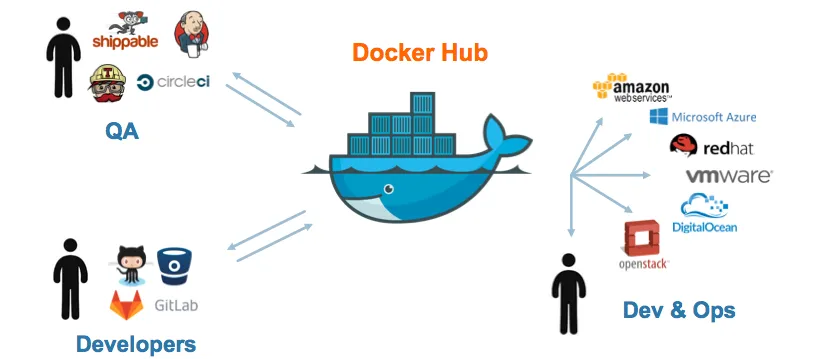

# D5 S1 : Building, Tagging, Publishing, and Optimizing a Docker Image with Distroless

Watch video: https://youtu.be/1OoHB5Q8Yhs

#### Prerequisites
- Basic understanding of Docker and containers
- Docker installed on your machine
- A Docker Hub account (or any container registry)



### 1. Building a Docker Image

Let's start by creating a simple Node.js application and building a Docker image for it.

1. **Create a Node.js Application:**

   Create a directory for your project:

   ```bash
   mkdir my-node-app
   cd my-node-app
   ```

   Initialize a Node.js project:

   ```bash
   npm init -y
   ```

   Install Express:

   ```bash
   npm install express
   ```

   Create an `app.js` file:

   ```javascript
   // app.js
   const express = require('express');
   const app = express();
   const PORT = process.env.PORT || 3000;

   app.get('/', (req, res) => {
       res.send('Hello, Docker!');
   });

   app.listen(PORT, () => {
       console.log(`Server is running on port ${PORT}`);
   });
   ```

2. **Create a Dockerfile:**

   A Dockerfile defines how your Docker image is built. Here's a simple Dockerfile:

   ```dockerfile
   # Use the official Node.js image as the base image
   FROM node:18-alpine

   # Set the working directory inside the container
   WORKDIR /app

   # Copy package.json and package-lock.json
   COPY package*.json ./

   # Install dependencies
   RUN npm install --production

   # Copy the rest of the application code
   COPY . .

   # Expose the port the app runs on
   EXPOSE 3000

   # Command to run the app
   CMD ["node", "app.js"]
   ```

3. **Build the Docker Image:**

   Now, build your Docker image using the Dockerfile:

   ```bash
   docker build -t my-node-app .
   ```

   This command builds the image and tags it as `my-node-app`.

### 2. Tagging the Docker Image

Tagging allows you to specify different versions of your Docker image.

```bash
docker tag my-node-app:latest my-node-app:v1.0.0
```

This command tags the `latest` image with a specific version (`v1.0.0`).

### 3. Publishing the Docker Image

You can publish your Docker image to a registry like Docker Hub.

1. **Log in to Docker Hub:**

   ```bash
   docker login
   ```

2. **Tag the Image with Your Docker Hub Username:**

   ```bash
   docker tag my-node-app:latest <your-dockerhub-username>/my-node-app:latest
   docker tag my-node-app:v1.0.0 <your-dockerhub-username>/my-node-app:v1.0.0
   ```

3. **Push the Image to Docker Hub:**

   ```bash
   docker push <your-dockerhub-username>/my-node-app:latest
   docker push <your-dockerhub-username>/my-node-app:v1.0.0
   ```

### 4. Optimizing the Docker Image with Distroless

Distroless images are minimal images that contain only your application and its runtime dependencies, making them more secure and smaller in size.

1. **Modify the Dockerfile for Distroless:**

   Update the Dockerfile to use a distroless base image:

   ```dockerfile
   # Use the Node.js builder image
   FROM node:18-alpine AS build

   # Set the working directory
   WORKDIR /usr/src/app

   # Copy package.json and package-lock.json
   COPY package*.json ./

   # Install dependencies
   RUN npm install --production

   # Copy the rest of the application code
   COPY . .

   # Build the app (if necessary, e.g., for React, Angular)
   # RUN npm run build

   # Use a distroless base image for the final stage
   FROM gcr.io/distroless/nodejs18

   # Set the working directory
   WORKDIR /usr/src/app

   # Copy the built application from the build stage
   COPY --from=build /usr/src/app .

   # Expose the port the app runs on
   EXPOSE 3000

   # Command to run the app
   CMD ["app.js"]
   ```

2. **Build the Distroless Docker Image:**

   Build the image as before:

   ```bash
   docker build -t my-node-app-distroless .
   ```

3. **Test the Distroless Image:**

   Run the distroless image to ensure it works as expected:

   ```bash
   docker run -p 3000:3000 my-node-app-distroless
   ```

4. **Publish the Distroless Image:**

   Tag and push the distroless image to Docker Hub:

   ```bash
   docker tag my-node-app-distroless:latest <your-dockerhub-username>/my-node-app-distroless:latest
   docker push <your-dockerhub-username>/my-node-app-distroless:latest
   ```

### 5. Maintaining Your Docker Images

Maintaining Docker images involves regularly:

- **Updating dependencies:** Update your base image and application dependencies to ensure security and performance.
- **Rebuilding the image:** Rebuild the image after updates using the same commands as before.
- **Retagging and republishing:** Tag the updated image with a new version and publish it to your registry.

### 6. Understanding Different Node.js Docker Image Naming Schemes

When working with Docker, you may notice various naming schemes for Node.js images, such as `alpine`, `slim`, `buster`, and more. These tags represent different versions and configurations of the base image, each optimized for specific use cases.

Here's a breakdown of some common Node.js image naming schemes:

### 1. **`node:<version>`**
   
   - **Example:** `node:18`
   - **Description:** This is the default Node.js image, which includes the full operating system (usually Debian or Ubuntu) with all the necessary tools and dependencies to run Node.js applications.
   - **Use Case:** Ideal for development environments where you need access to a complete Linux environment with build tools, debugging tools, and other utilities.

### 2. **`node:<version>-slim`**

   - **Example:** `node:18-slim`
   - **Description:** The `slim` variant is a lighter version of the default Node.js image. It removes unnecessary packages and tools to reduce the image size while still providing a functional environment for running Node.js applications.
   - **Use Case:** Suitable for production environments where a smaller image size is beneficial, but you still require some of the base operating system utilities.

### 3. **`node:<version>-alpine`**

   - **Example:** `node:18-alpine`
   - **Description:** The `alpine` variant is based on the Alpine Linux distribution, known for its minimal size and security. The Alpine version of Node.js images is significantly smaller than the `slim` variant.
   - **Use Case:** Best for production environments where minimal size and security are priorities. However, some native modules may require additional configuration when using Alpine due to its differences from more traditional Linux distributions.

### 4. **`node:<version>-buster`**

   - **Example:** `node:18-buster`
   - **Description:** This variant is based on Debian Buster, which is a stable release of the Debian operating system. It includes more comprehensive packages and tools compared to the `slim` and `alpine` variants.
   - **Use Case:** Ideal for environments that require stability and access to a broader set of Debian packages and tools.

### 5. **`node:<version>-bullseye`**

   - **Example:** `node:18-bullseye`
   - **Description:** Similar to the `buster` variant, but based on Debian Bullseye, the newer release of Debian. It provides up-to-date software packages and support.
   - **Use Case:** Suitable for environments that need the latest Debian-based packages and libraries, ensuring compatibility with newer tools.

### 6. **`node:<version>-stretch`**

   - **Example:** `node:18-stretch`
   - **Description:** This variant is based on Debian Stretch, an older stable release of Debian. It's now considered outdated and typically used only for legacy systems.
   - **Use Case:** Use this only if you have dependencies that require Debian Stretch specifically.

### 7. **`node:<version>-windowsservercore`**

   - **Example:** `node:18-windowsservercore`
   - **Description:** A Node.js image designed to run on Windows Server Core, suitable for Windows-based environments.
   - **Use Case:** Use this variant when you need to run Node.js applications on Windows containers.

### 8. **`node:<version>-distroless`**

   - **Example:** `node:18-distroless`
   - **Description:** A minimal, production-ready image that only contains the Node.js runtime and your application, without any additional OS packages or tools.
   - **Use Case:** Best for production environments where security, performance, and minimal image size are critical. This variant is harder to debug due to the lack of tools in the image.

### Choosing the Right Image

- **Development:** Use the full `node:<version>` image for a complete development environment.
- **Production (General):** Use `slim` or `alpine` variants for smaller image sizes and faster deployment times.
- **Production (Minimal):** Use `distroless` for the smallest possible image with security in mind.
- **Specific OS Requirements:** Choose the appropriate variant (`buster`, `bullseye`, `stretch`, or `windowsservercore`) based on the operating system requirements of your application.

